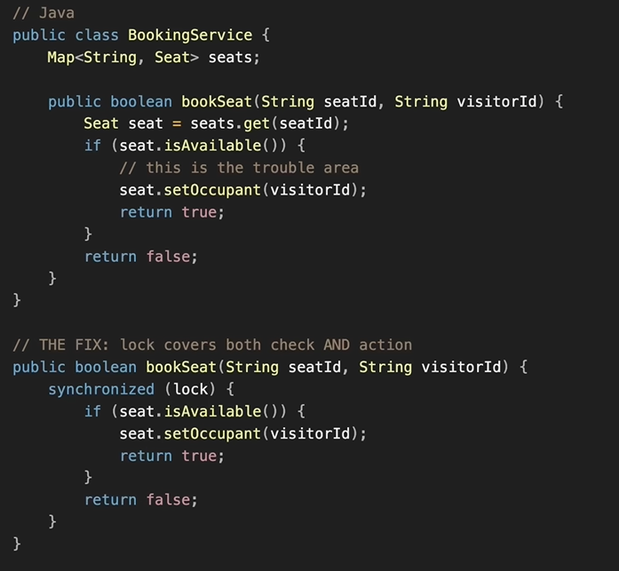
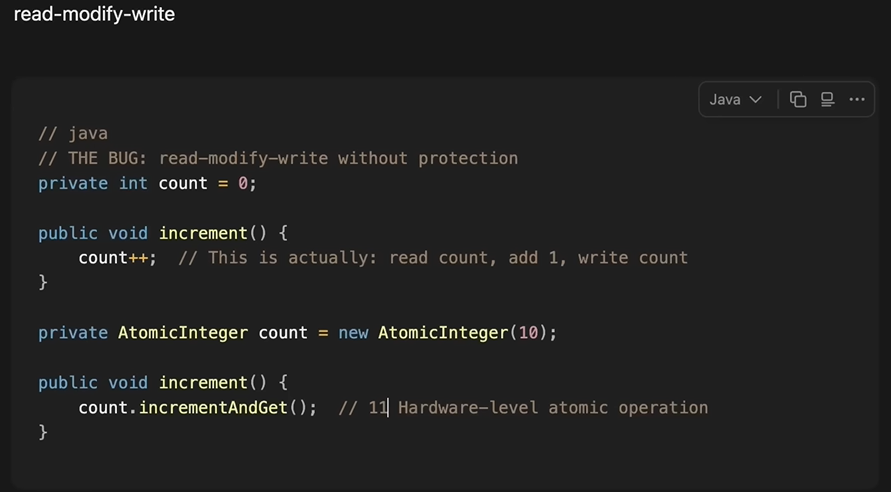
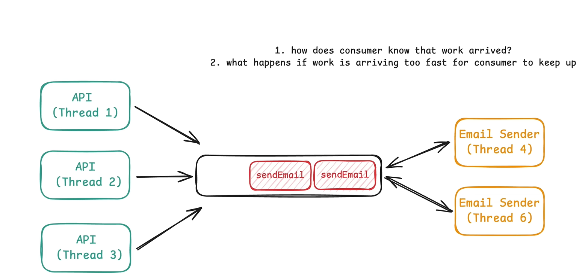
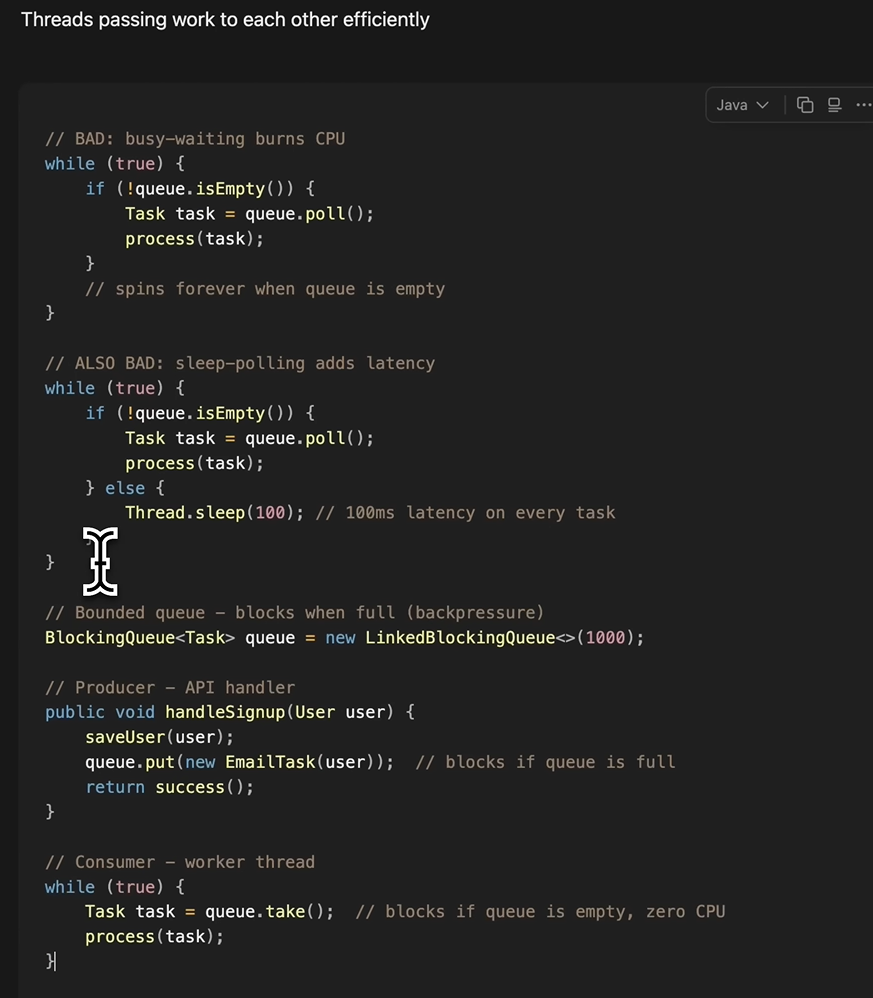
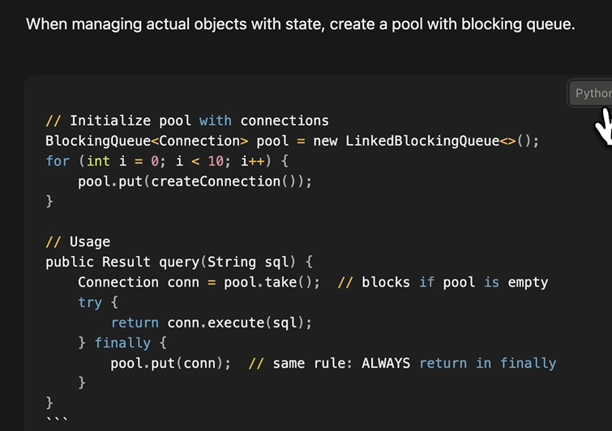

## What is Concurrency
Concurrency is when multiple threads working simultaneously to perform same operation for different requests.

This causes issues like race conditions, deadlocks.
3 categories of LLD Concurrency problems:
* Correctness
* Coordination
* Scarcity

### CORRECTNESS
Shared state gets corrupted when different threads try to access it at same time.

Intuition - Is there shared state which you access concurrently?

Patterns  
* Check then act - You check for availability and then only you act. What is different threads checks the same resource at same time, all will pass the condition even if only 1 record available.
At HLD, Such problems are tackled by **atomicity** in database. At LLD, such issues are tackled by **Locks**

* Read-Modify-Write - Similarly for locking/atomicity in for just counter/flags, we can use atomic class in java.

Solution = Locks, Atomic Variables

### Coordination
Threads passing work to each other

Intuition - Work flow from 1 thread to another.

Above is simple flow of user signup and email has been sent to user. Now we dont want signup request to be blocked for sending email, so we can build a **Producer-Consumer** architecture and pass via queue.

Solution = BlockingQueues

### SCARCITY
Limiting concurrent access to finite resources - When 3rd party only allows limited concurrent requests.

Intuition - Limited resources?

Solution  * Semaphore, BlockingQueue